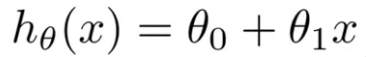

Explanation of Exercises 
=======
This repo contains the solutions for Andrew Ng's Machine Learning Coursera course.
The Machine Learning course teaches the building blocks of machine learning,
and the exercises completed in this repo implement the algorithms / functions
described in the course. This README serves to provide a logical explanation 
for the concepts involved in those exercises.

## Intro to Supervised Learning
Some of the initial exercises focus on solving problems which fall into the
category of **supervised learning**. This is a type of learning method where
right answers are given, and the program must produce more right answers.
Traditionally, supervised learning can be applied in two ways, regression,
and classification. **Regression** is used to predict continuous valued output,
while **classification** is used to predict a discrete valued output.
These sorts of problems all follow this general model:   
1. Acquire a labeled data set, where some number of features X map to some 
label in Y. 
2. Define some learning algorithm which, given a sample input, makes a guess
as to what its label should be.
3. Evaluate and iterate over the performance of the learning algorithm until it
can accuratlely identify labels given a sample input of features

## Exercise 1 : Linear Regression
Linear Regression is most commonly applied to solve the problem of: I have some
set of data, and I want to see how I can predict future data. In
this manner, you can predict behavior based off of pre-observed behavior. For
example, if I have a set of data on houses with the square footage and pricing
of each house, one could apply linear regression to predict the price of a house
given its square footage.

Following the model of supervised learning, you then establish a hypothesis 
function based off of the data. The hypothesis function is based off of a 
combination of the **features**, or **X**, and the **weights**, also known as
**parameters**, commonly referred to as **theta, Θ.**

An example hypothesis function with one variable may look like this:  

