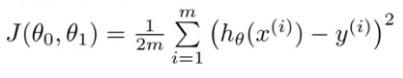

Explanation of Exercises 
=======
This repo contains the solutions for Andrew Ng's Machine Learning Coursera course.
The Machine Learning course teaches the building blocks of machine learning,
and the exercises completed in this repo implement the algorithms / functions
described in the course. This README serves to provide a logical explanation 
for the concepts involved in those exercises.

## Intro to Supervised Learning
Some of the initial exercises focus on solving problems which fall into the
category of **supervised learning**. This is a type of learning method where
right answers are given, and the program must produce more right answers.
Traditionally, supervised learning can be applied in two ways, regression,
and classification. **Regression** is used to predict continuous valued output,
while **classification** is used to predict a discrete valued output.
These sorts of problems all follow this general model:   
1. Acquire a labeled data set, where some number of features X map to some 
label in Y. 
2. Define some learning algorithm which, given a sample input, makes a guess
as to what its label should be.
3. Evaluate and iterate over the performance of the learning algorithm until it
can accuratlely identify labels given a sample input of features

## Exercise 1 : Linear Regression
Linear Regression is most commonly applied to solve the problem of: I have some
set of data, and I want to see how I can predict future data. In
this manner, you can predict behavior based off of pre-observed behavior. For
example, if I have a set of data on houses with the square footage and pricing
of each house, one could apply linear regression to predict the price of a house
given its square footage.

Following the model of supervised learning, you then establish a hypothesis 
function based off of the data. The hypothesis function is based off of a 
combination of the **features**, or **X**, and the **weights**, also known as
**parameters**, commonly referred to as **theta, Θ.**

An example hypothesis function with one variable may look like this:  
  
and in fact, this is the function that we use in this exercise. The first term
is theta-0 and the first part of the second term is theta-1. The small x may
represent the square footage of one house. Thus, this function attempts to 
determine the price of that house, based off of x and Θ. The question then is
how is that done? How does this function come up with the Θ required to find
the line of best fit, and thereby accurately predict the price of a house given
its square footage? That is the third part of any linear regression implementation,
the iterative improvement process.

Thus far, we have established a hypothesis function **h**, with parameters **Θ** 
and features **X**. The parameters influence the shape of h, thus we want to 
generate parameters that accurately predict output. To do this, we observe the
following cost function  
   
In this context, this function tells us, given our current Θ, how incorrect
our guesses are for the price of a house, compared to the actual prices. The 
goal then, is to minimize this cost function. In other words, make our Θ as 
accurate as possible, and thus our line of best fit as appropriate as possible.

The minimization is done by the following  
  
What this translates to is a process that simultaneously updates all elements
in Θ. The update to each element in theta basically pushes it towards a value
that produces less error in the cost function detailed above. This process is 
referred to as **gradient descent**. Essentially, theta is continuously updated
until it eventually converges on some minimum cost.

Thus, linear regression is complete. A hypothesis function is established, a
cost function is defined to determine the hypothesis' performance, and gradient
descent is used to eventually minimize the cost of that hypothesis function.  

## Exercise 2 : Logistic Regression
Logistic Regression as a standalone application is typically applied to
**classification** problems. Classification problems being those where the y value 
is discrete. There are binary classification problems where y is the set of {0,1},
and multiclass classification problems where y is the set of {0,1,2,3,...}. 

The reason logistic regression instead of linear regression is applied to 
classification problems is because the hypothesis function for linear regression
can produce output outside of the bonds of the classification values. Logistic
regression aims to produce output always within classification bounds. This 
behavior is inherent in the construction of the hypothesis function.

Whereas the hypothesis function for linear regression is the dot product of 
theta transpose and X,  
  
the hypothesis function for logistic regression is actually a function of that   

